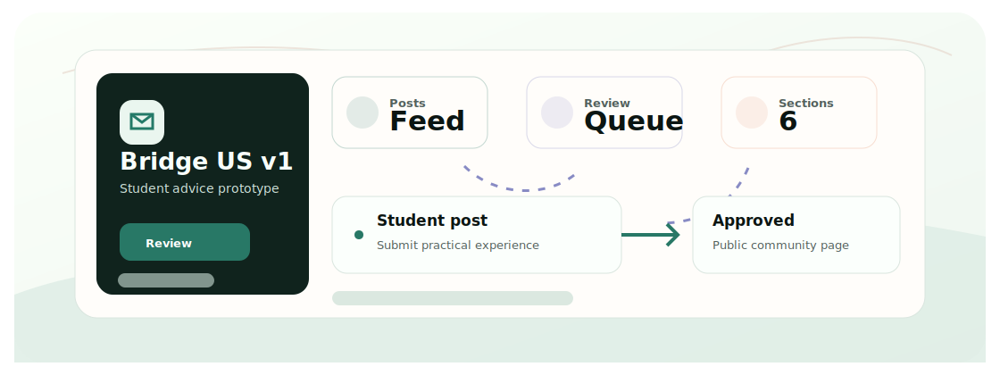

<div align="center">
  <h1>Bridge US</h1>
  <p>一个早期 Flask 社区原型，帮助国际学生分享赴美初期的实用经验。</p>

  <p>
    <a href="README.md">English</a>
    &middot;
    <a href="#快速开始">快速开始</a>
    &middot;
    <a href="#技术栈">技术栈</a>
    &middot;
    <a href="https://github.com/Ha22yX/Bridge-US-V2">Bridge-US V2</a>
  </p>

  <p>
    
    
    
  </p>
</div>

<p align="center">
  
</p>

## 项目价值

新国际学生常常只能从零散群聊和社交平台获取租房、交通、安全和初到美国的信息。Bridge US v1 是一个小型审核社区原型，用来整理这些经验。

## 快速开始

```bash
git clone https://github.com/Ha22yX/Bridge-US.git
cd Bridge-US
python -m venv .venv
.venv\Scripts\activate
pip install -r requirements.txt
python app.py
```

打开 `http://127.0.0.1:5000`。相比 V2，这个 v1 仓库刻意保持简单。

## 核心功能

- 按初到美国、租房、饮食、交通、生活事务和安全等板块组织帖子。
- 支持注册、登录、投稿和后台审核队列。
- 只有审核通过的内容才公开展示。
- 面向国际学生场景设计中英文界面方向。

## 技术栈

| Layer | Technology | Role |
| --- | --- | --- |
| 后端 | Flask | 路由、模板和会话。 |
| 数据 | SQLite | 原型内容的本地数据库。 |
| 国际化 | Flask-Babel | 双语界面文本。 |
| 前端 | Jinja, CSS | 服务端渲染社区页面。 |


## 项目说明

[Bridge-US](https://github.com/Ha22yX/Bridge-US) 和 [Bridge-US-V2](https://github.com/Ha22yX/Bridge-US-V2) 目标相同，但它们是完全独立的项目。v1 是早期、较简陋的 Flask 原型；v2 是更完整的全栈重构版本。
